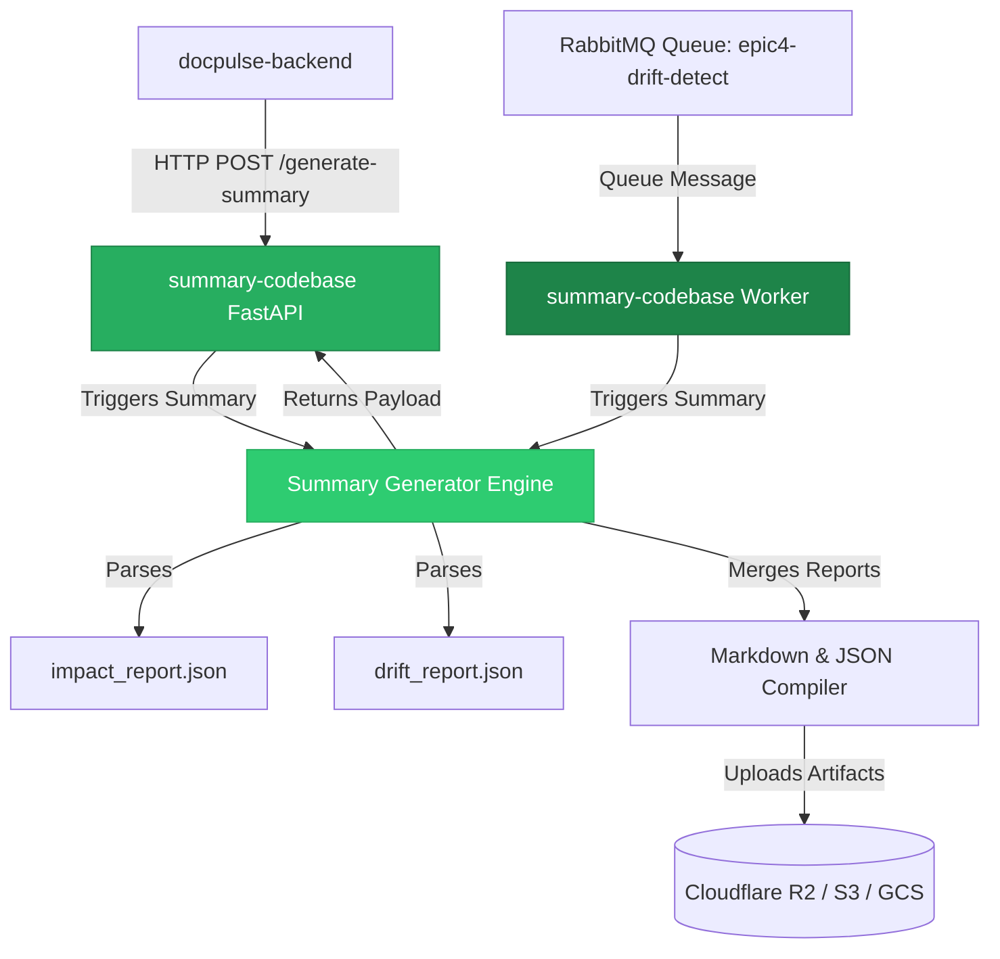
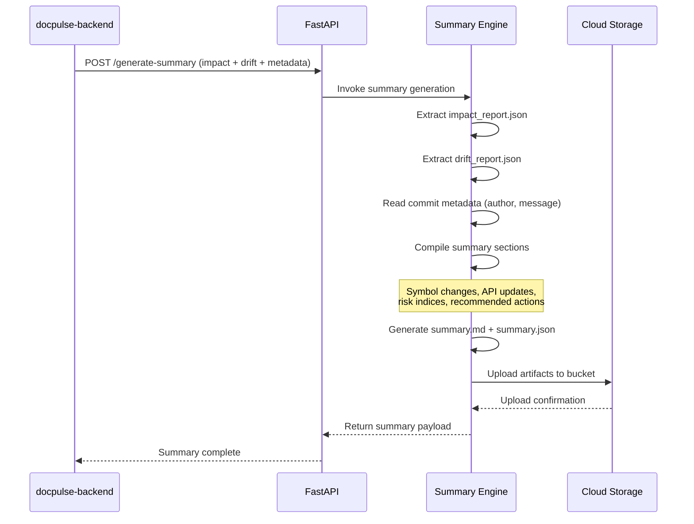
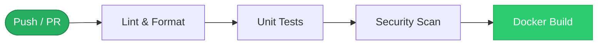
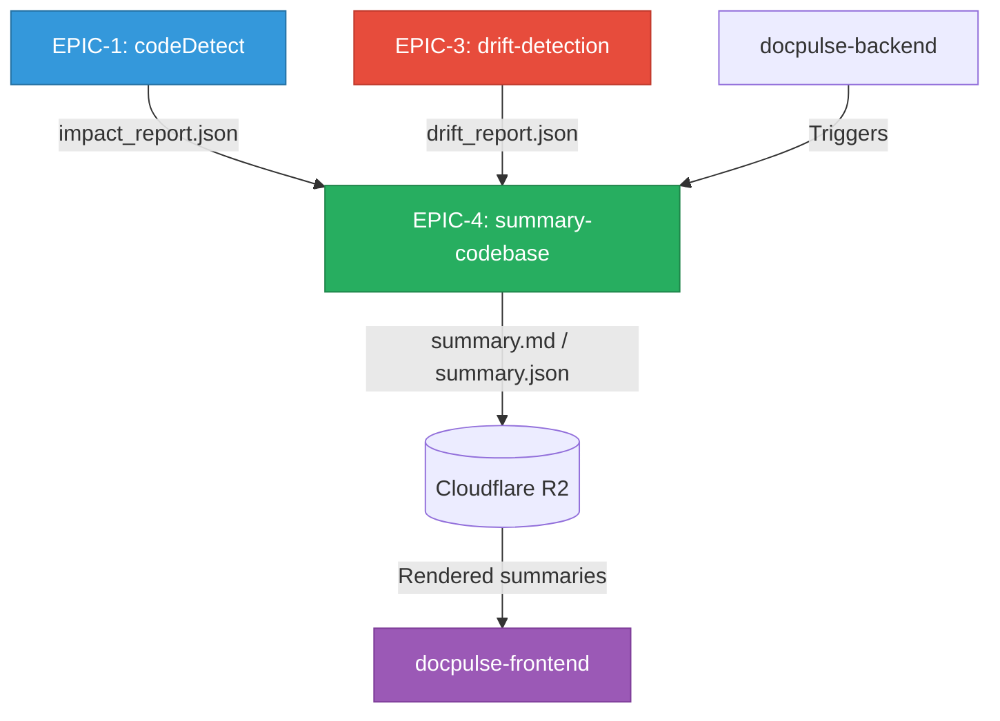

<div align="center">

# summary-codebase

**Change Summary Generator**

[](https://www.python.org/downloads/release/python-3110/)
[](https://fastapi.tiangolo.com/)
[](#technology-stack)
[](https://github.com/features/actions)
[](Dockerfile)

*Part of the [DocPulseAI](https://github.com/DocPulseAI) ecosystem — **EPIC-4: Impact Summary***

---

**summary-codebase** is a production-grade Python service that generates human-readable Markdown summaries from code impact analyses and documentation drift reports. It is the final stage of the DocPulseAI documentation pipeline — synthesizing all upstream findings into a single, elegant change log that developers, reviewers, and managers can read at a glance.

</div>

---

## Table of Contents

- [Purpose](#purpose)
- [Responsibilities](#responsibilities)
- [Architecture Overview](#architecture-overview)
- [Technology Stack](#technology-stack)
- [Directory Structure](#directory-structure)
- [Environment Variables](#environment-variables)
- [Installation](#installation)
- [Local Development](#local-development)
- [Testing](#testing)
- [Docker](#docker)
- [CI/CD](#cicd)
- [Integration with DocPulseAI](#integration-with-docpulseai)
- [Deployment](#deployment)
- [Troubleshooting](#troubleshooting)
- [Roadmap](#roadmap)
- [Contributing](#contributing)

---

## Purpose

- **Business Purpose**: Provide developers, code reviewers, and managers with an elegant, deterministic summary of what changed in a commit, why it changed, and how it impacts documentation.
- **Technical Purpose**: Consume structured impact and drift logs, apply automated text compiler logic, generate high-quality Markdown summaries (`summary.md` and `summary.json`), and persist them in cloud storage.

---

## Responsibilities

| Domain | Description |
|---|---|
| **Summary Compilation** | Compile code severity, modified symbols, routes, breaking changes, and drift alerts into a single unified change log. |
| **Multi-Cloud Storage** | Support multiple storage providers (Cloudflare R2, AWS S3, Google Cloud Storage) for artifact persistence. |
| **Queue Integration** | Support async processing of documentation updates through RabbitMQ events. |
| **Report Formatting** | Generate both Markdown (`summary.md`) and structured JSON (`summary.json`) outputs for different consumers. |

---

## Architecture Overview

`summary-codebase` operates as an independent FastAPI microservice:



### Summary Generation Pipeline



1. **Report Extraction**: Parse `impact.json` and `drift.json` inputs.
2. **Metadata Merging**: Read commit author and message details from snapshots.
3. **Markdown Compilation**: Formulate summary sections (symbol changes, API updates, risk indices, recommended actions).
4. **Cloud Upload**: Push `summary.md` and `summary.json` to the target bucket folder.

---

## Technology Stack

| Category | Technology | Version | Purpose |
|---|---|---|---|
| **Runtime** | Python | 3.11+ | Core runtime |
| **Framework** | FastAPI + Uvicorn | 0.100+ / 0.20+ | Async REST API serving |
| **Storage (R2/S3)** | boto3 | Latest | Cloudflare R2 and AWS S3 compatible uploads |
| **Storage (GCS)** | google-cloud-storage | Latest | Google Cloud Storage uploads |
| **Validation** | Pydantic | 2.0+ | Schema validation and configuration |
| **GitHub** | Custom client | — | GitHub API integration for commit metadata |
| **Testing** | Pytest | 7.0+ | Unit and integration testing |

---

## Directory Structure

```
summary-codebase/
├── artifacts/              # Diagnostics logs and local build outputs
├── src/                    # Service source code
│   ├── api.py              # FastAPI application and route endpoints
│   ├── config.py           # Configuration environment parser
│   ├── github_client.py    # GitHub client API integration wrapper
│   ├── storage_client.py   # Multi-provider cloud storage uploader (R2/S3/GCS)
│   ├── summary.py          # Summary generator engine
│   ├── utils.py            # Event logging and formatting helpers
│   └── run.py              # CLI runtime executor
├── tests/                  # Pytest unit and integration test scripts
├── worker/                 # Worker process for async queue events
│   └── epic4_worker.py     # Worker runner script
├── Dockerfile              # Production container definition
└── requirements.txt        # Service dependency manifest
```

---

## Environment Variables

| Variable | Purpose | Required | Default |
|---|---|---|---|
| `PORT` | FastAPI server port | No | `5003` |
| `R2_ACCOUNT_ID` | Cloudflare account identifier | No | — |
| `R2_BUCKET_NAME` | Cloudflare R2 bucket name | No | `ci-living-docs` |
| `R2_ACCESS_KEY_ID` | Cloudflare API access key | No | — |
| `R2_SECRET_ACCESS_KEY` | Cloudflare API secret key | No | — |
| `DOCS_BUCKET_PATH` | Fallback bucket path pattern | No | `projects/docs/` |
| `LOG_LEVEL` | Logging granularity | No | `INFO` |

---

## Installation

### Prerequisites

- Python 3.11.x
- Cloud storage access permissions (R2, S3, or GCS)

### Setup

```bash
# Navigate to the directory
cd summary-codebase

# Create and activate virtual environment
python -m venv .venv
source .venv/bin/activate

# Install dependencies
pip install --upgrade pip
pip install -r requirements.txt
```

---

## Local Development

### Run HTTP Service

```bash
PYTHONPATH=. uvicorn src.api:app --host 0.0.0.0 --port 5003 --reload
```

View the Swagger documentation at [http://localhost:5003/docs](http://localhost:5003/docs).

### Run CLI Engine

```bash
PYTHONPATH=. python src/run.py \
  --impact path/to/impact.json \
  --drift path/to/drift.json \
  --commit 63d36c2b \
  --output path/to/output_dir/
```

---

## Testing

```bash
PYTHONPATH=. pytest tests/
```

---

## Docker

```bash
# Build image
docker build -t docpulse-summary-codebase .

# Run container
docker run -p 5003:5003 --env-file src/.env docpulse-summary-codebase
```

---

## CI/CD



| Workflow | Trigger | Purpose |
|---|---|---|
| `ci.yml` | Push / PR | Lint, unit tests |
| `security.yml` | Push / PR | Dependency vulnerability scanning |

---

## Integration with DocPulseAI

summary-codebase is the **final stage** of the documentation pipeline — it produces the deliverable that users actually read:



| Relationship | Description |
|---|---|
| **← EPIC-1 (codeDetect)** | Consumes `impact_report.json` — extracts severity scores, symbol changes, and breaking API updates. |
| **← EPIC-3 (drift-detection)** | Consumes `drift_report.json` — incorporates drift alerts and documentation coverage gaps into the summary. |
| **→ Cloudflare R2** | Uploads `summary.md` (human-readable) and `summary.json` (machine-parseable) to versioned storage paths. |
| **→ docpulse-frontend** | Summaries are rendered in the dashboard as the primary change log artifact for each pipeline run. |

---

## Deployment

Deployable as a web service using **Render** or any Docker-compatible hosting platform.

- **Multi-Cloud Storage**: The `StorageClient` class supports Google Cloud Storage (`google-cloud-storage`) and AWS S3/R2 (`boto3`).
- **Health Check**: Endpoint `/health` reports service readiness and cloud storage availability.

---

## Troubleshooting

### Upload Fails with Credential Errors
- **Symptom**: Logs show `EPIC4_UPLOAD_FAILED` or storage client authorization errors.
- **Solution**: Confirm that access keys match the configured cloud provider. If using R2, ensure `R2_ACCOUNT_ID` is defined.

### Missing Git Info in Summaries
- **Symptom**: Summary Markdown lists author and message details as "Unknown".
- **Solution**: Pass a valid `doc_snapshot` payload containing `author` and `message` properties in the request body of `/generate-summary`.

---

## Roadmap

| Phase | Feature | Status |
|---|---|---|
| **v1.0** | Markdown summary compilation from impact + drift | ✅ Complete |
| **v1.0** | Multi-cloud storage support (R2, S3, GCS) | ✅ Complete |
| **v1.0** | FastAPI REST API with Swagger docs | ✅ Complete |
| **v1.1** | Risk severity scoring and recommended actions | 🔨 In Progress |
| **v1.2** | AI-augmented executive summaries | 📋 Planned |
| **v1.2** | Historical change trend analysis | 📋 Planned |
| **v2.0** | Slack / Teams notification integration | 📋 Planned |
| **v2.0** | Customizable summary templates | 📋 Planned |

---

## Contributing

1. Ensure new summary sections match formatting guides.
2. Check for schema updates using `schemas` validations before deploying.
