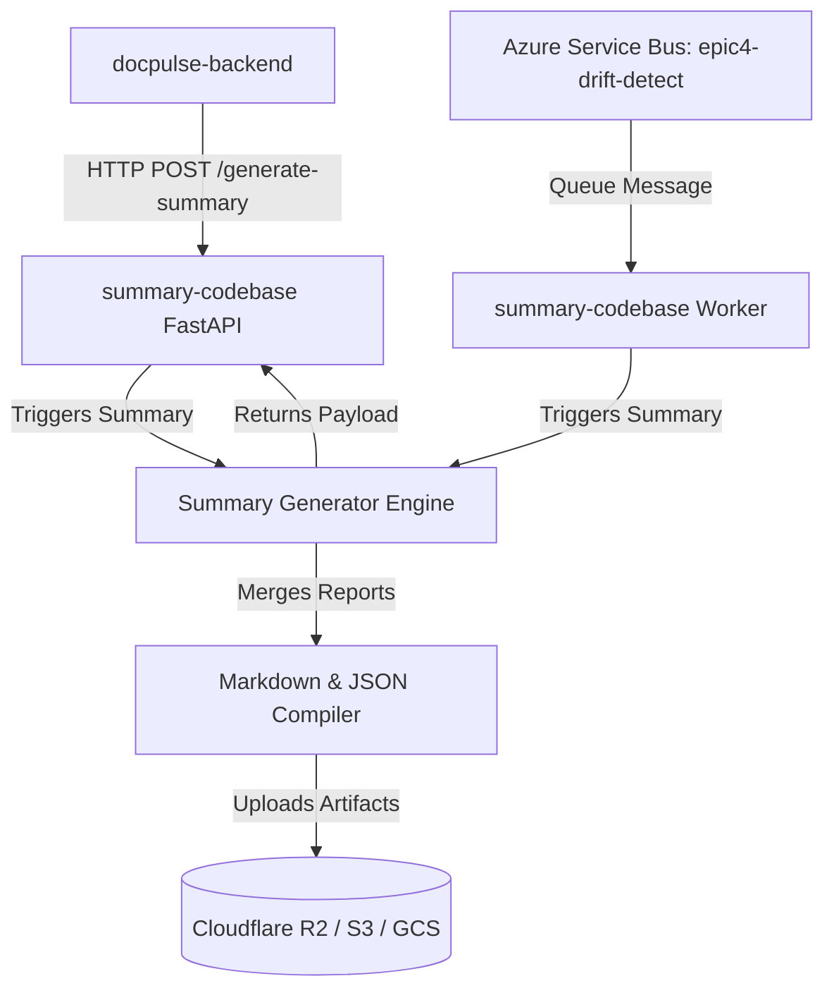

# summary-codebase

Production-grade Python service for change summary generation. It acts as **EPIC-4** in the DocPulseAI pipeline, generating human-readable Markdown summaries from code impact analyses (EPIC-1) and documentation drift reports (EPIC-3), uploading the final deliverables to cloud storage (R2/S3/GCS).

## Purpose
- **Business Purpose**: Provide developers, code reviewers, and managers with an elegant, deterministic summary of what changed in a commit, why it changed, and how it impacts documentation.
- **Technical Purpose**: Consume structured impact and drift logs, apply automated text compiler logic, generate high-quality Markdown summaries (`summary.md` and `summary.json`), and persist them in cloud storage.

## Responsibilities
- **Summary Compilation**: Compile code severity, modified symbols, routes, breaking changes, and drift alerts into a single unified change log.
- **Cloud Storage Persistence**: Support multiple storage clients (Cloudflare R2, AWS S3, Google Cloud Storage) to upload generated artifacts.
- **Queue integration**: Support async processing of documentation updates through service bus events.

## Architecture Overview
`summary-codebase` operates as an independent FastAPI microservice:



### Summary Generation Stages:
1. **Report Extraction**: Extract and parse `impact.json` and `drift.json`.
2. **Metadata Merging**: Read commit author and message details from snapshots.
3. **Markdown Compilation**: Formulate summary sections (symbol changes, API updates, risk indices, recommended actions).
4. **Cloud Upload**: Push `summary.md` and `summary.json` to the target bucket folder.

---

## Technology Stack
- **Runtime**: Python 3.11+
- **Framework**: FastAPI (v0.100.0+) + Uvicorn (v0.20.0+)
- **Cloud Storage Clients**:
  - `boto3` (AWS S3 & Cloudflare R2 compatibility)
  - `google-cloud-storage` (Google Cloud Storage compatibility)
- **Data Validation**: Pydantic (v2.0.0+)
- **Testing Framework**: Pytest (v7.0.0+)

---

## Directory Structure
```
summary-codebase/
├── artifacts/              # Diagnostics logs and local build outputs
├── src/                    # Service source code
│   ├── api.py              # FastAPI application and route endpoints
│   ├── config.py           # Configuration environment parser
│   ├── github_client.py    # GitHub client API integration wrapper
│   ├── storage_client.py   # Multi-provider cloud storage uploader (R2/S3/GCS)
│   ├── summary.py          # Summary generator engine
│   ├── utils.py            # Event logging and formatting helpers
│   └── run.py              # CLI runtime executor
├── tests/                  # Pytest unit and integration test scripts
├── worker/                 # Worker process for async queue events
│   └── epic4_worker.py     # Worker runner script
├── Dockerfile              # Production container definition
└── requirements.txt        # Service dependency manifest
```

---

## Environment Variables

| Variable Name | Purpose | Required? | Default / Example |
|---|---|---|---|
| `PORT` | FastAPI server port | No | `5003` |
| `R2_ACCOUNT_ID` | Cloudflare account identifier | No | `your-account-id` |
| `R2_BUCKET_NAME` | Cloudflare R2 bucket name | No | `ci-living-docs` |
| `R2_ACCESS_KEY_ID` | Cloudflare API access key | No | `your-access-key-id` |
| `R2_SECRET_ACCESS_KEY`| Cloudflare API secret key | No | `your-secret-access-key` |
| `DOCS_BUCKET_PATH` | Fallback bucket path pattern | No | `projects/docs/` |
| `LOG_LEVEL` | Level of logging granularity | No | `INFO` |

---

## Installation

### Prerequisites
- Python 3.11.x
- Cloud Storage access permissions

### Setup Steps
1. Navigate to the directory:
   ```bash
   cd summary-codebase
   ```
2. Create and activate a Python virtual environment:
   ```bash
   python -m venv .venv
   source .venv/bin/activate
   ```
3. Install dependencies:
   ```bash
   pip install --upgrade pip
   pip install -r requirements.txt
   ```

---

## Local Development

### Run HTTP Service
Start the FastAPI server on port `5003`:
```bash
PYTHONPATH=. uvicorn src.api:app --host 0.0.0.0 --port 5003 --reload
```
View the Swagger documentation at [http://localhost:5003/docs](http://localhost:5003/docs).

### Run CLI Engine
```bash
PYTHONPATH=. python src/run.py --impact path/to/impact.json --drift path/to/drift.json --commit 63d36c2b --output path/to/output_dir/
```

---

## Testing

Execute the test suite:
```bash
PYTHONPATH=. pytest tests/
```

---

## Docker

### Build Image
```bash
docker build -t docpulse-summary-codebase .
```

### Run Container
```bash
docker run -p 5003:5003 --env-file src/.env docpulse-summary-codebase
```

---

## Deployment

Deployable as a web service using **Render** or on **Azure Container Apps**.

- **Multi-Cloud Storage**: The `StorageClient` class supports Google Cloud Storage (`google-cloud-storage`) and AWS S3/R2 (`boto3`).
- **Health Check**: Endpoint `/health` reports service readiness and cloud storage availability.

---

## Troubleshooting

### Upload fails with credential errors
- **Symptom**: Logs show `EPIC4_UPLOAD_FAILED` or storage client authorization errors.
- **Solution**: Confirm that access keys match the configured cloud provider. If using R2, ensure `R2_ACCOUNT_ID` is defined.

### Missing Git Info in Summaries
- **Symptom**: Summary Markdown lists author and message details as "Unknown".
- **Solution**: Pass a valid `doc_snapshot` payload containing `author` and `message` properties in the request body of `/generate-summary`.

---

## Contributing
1. Ensure new summary sections match formatting guides.
2. Check for schema updates using `schemas` validations before deploying.
